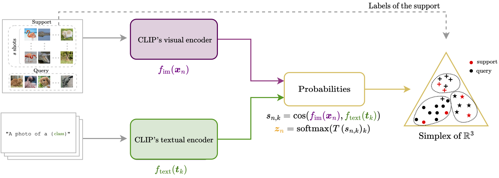

# Transductive zero-shot and few-shot CLIP

This GitHub repository features code from our paper where we tackle zero-shot and few-shot classification using vision-language models like CLIP. Our approach handles groups of unlabeled images together, enhancing accuracy over traditional methods that consider each image separately. We build a new classification framework based on classification of probability features and an optimization technique that mimics the Expectation-Maximization algorithm. On zero-shot tasks with test batches of 75 samples, our approaches **EM-Dirichlet** and **Hard EM-Dirichlet** yield near 20$\%$ improvement in ImageNet accuracy over CLIP's zero-shot performance. 



## 1. Getting started

### 1.1. Requirements

- pytorch 1.7 (or later)
- torchvision 
- tqdm
- numpy
- pillow
- pyyaml
- scipy
- [clip](https://github.com/openai/CLIP)


### 1.2 Download datasets and splits
For downloading the datasets and splits, we follow the instructions given in the Github repository of [TIP-Adapter](https://github.com/gaopengcuhk/Tip-Adapter). We use train/val/test splits from [CoOp's Github](https://github.com/KaiyangZhou/CoOp) for all datasets except ImageNet where the validation set is used as test set.

The downloaded datasets should be placed in the folder data/ the following way:

    .
    ├── ...
    ├── data           
    │   ├── food101       
    │   ├── eurosat       
    │   ├── dtd       
    │   ├── oxfordpets       
    │   ├── flowers101     
    │   ├── caltech101      
    │   ├── ucf101       
    │   ├── fgvcaircraft                
    │   ├── stanfordcars      
    │   ├── sun397        
    │   └── imagenet               
    └── ...

### 1.3 Extracting and saving the features
For a fixed temperature ($T=30$ recommended), we extract and save the softmax features defined as
```math 
z_n = \text{softmax}(T \cos(f_{\text{im}}(x_n), f_{\text{text}}(t_k) )).
```
To do so, run ```bash scripts/extract_softmax_features.sh```
For instance, for the dataset eurosat, the temperature T=30 and the backbone RN50, the features will be saved under

    eurosat
    ├── saved_features                    
    │   ├── test_softmax_RN50_T30.plk
    │   ├── val_softmax_RN50_T30.plk           
    │   ├── train_softmax_RN50_T30.plk           
    └── ...

Alternatively, to reproduce the comparisons in the paper, you can also compute directly the visual embeddings running ```bash scripts/extract_visual_features.sh```.

The process of extracting features might be time-consuming, but once completed, the methods operates quite efficiently.

## 2. Reproducing the zero-shot results

You can reproduce the results displayed in Table 1 in the paper by using the ```config/main_config.yaml``` file.

The zero-shot methods are EM-Dirichlet (```em_dirichlet```), Hard EM-Dirichlet (```hard_em_dirichlet```), Hard K-means (```hard_kmeans```), Soft K-means (```soft_kmeans```), EM-Gaussian (Id cov) (```em_gaussian```), EM-Gaussian (diagonal con) (```em_dirichlet_cov```), KL K-means (```kl_kmeans```). 

The methods can be tested on the softmax features by setting ```use_softmax_features=True``` or the visual features ```use_softmax_features=False```.

For example, to run the method EM-Dirichlet on Caltech101 on 1000 realistic tranductive zero-shot tasks: 
```python
python main.py --shots 0 dataset caltech101 opts batch_size 100 number_tasks 1000 use_softmax_feature True
```

## 3. Reproducing the zero-shot results


